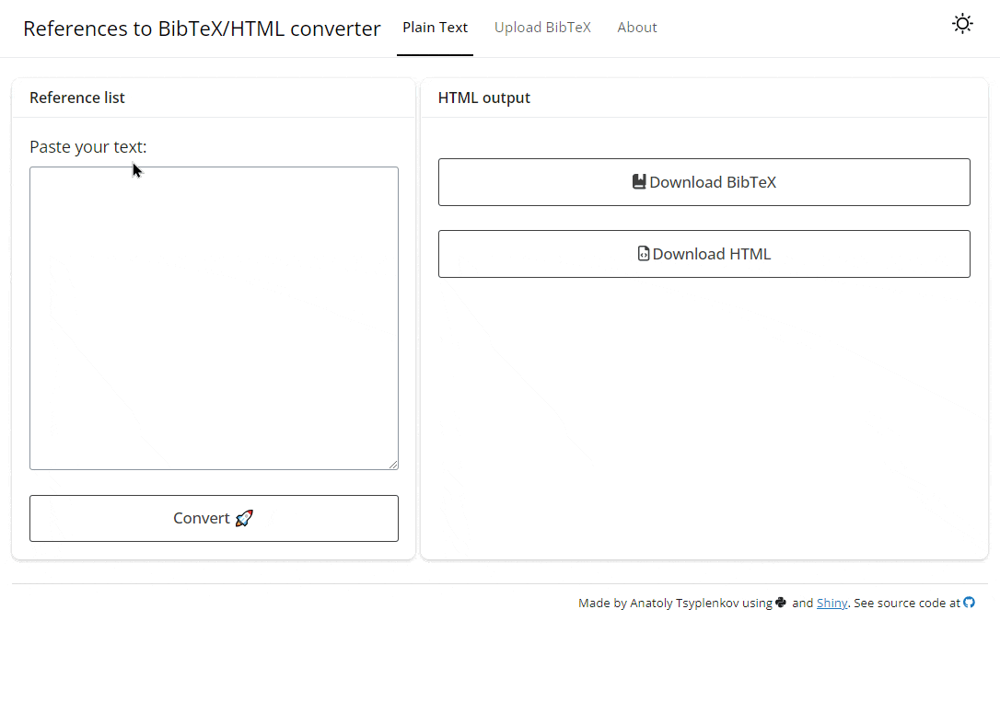

<div align="center">
  <a href="https://journals.psu.edu/geomorphica/">
  
  </a>
</div>

### Overview
This small application was created to ease the copyediting and typesetting of articles submitted to the [Geomorphica](https://journals.psu.edu/geomorphica/) journal.

In the first tab, one can convert formatted references to BibTeX.

**From:**

`Mensh, B., & Kording, K. (2017). Ten simple rules for structuring papers. PLOS Computational Biology, 13(9), e1005619. https://doi.org/10.1371/journal.pcbi.1005619`

**To:**
```
@article{mensh2017ten,
  title={Ten simple rules for structuring papers},
  author={Mensh, B. and Kording, K.},
  journal={PLOS Computational Biology},
  volume={13},
  number={9},
  pages={e1005619},
  year={2017},
  doi={10.1371/journal.pcbi.1005619}
}
```

The function uses a large language model (LLM) in the background (via the [g4f Python library](https://github.com/xtekky/gpt4free/)), so it is expected to work with any Citation Style Language (CSL). It then returns the references in [APA7 style](https://github.com/citation-style-language/styles/blob/master/apa.csl) as HTML, which can be further used on a website.

The second tab allows users to upload a BibTeX file and create an APA7 style bibliography in HTML format.

```
<p>Mensh, B., &amp; Kording, K. (2017). Ten simple rules for structuring papers. <i>PLOS Computational Biology</i>, <i>13</i>(9), e1005619. <a href="https://doi.org/10.1371/journal.pcbi.1005619" target="_blank">https://doi.org/10.1371/journal.pcbi.1005619</a><br></p>
```


### Example
<div align="center">
  
</div>
